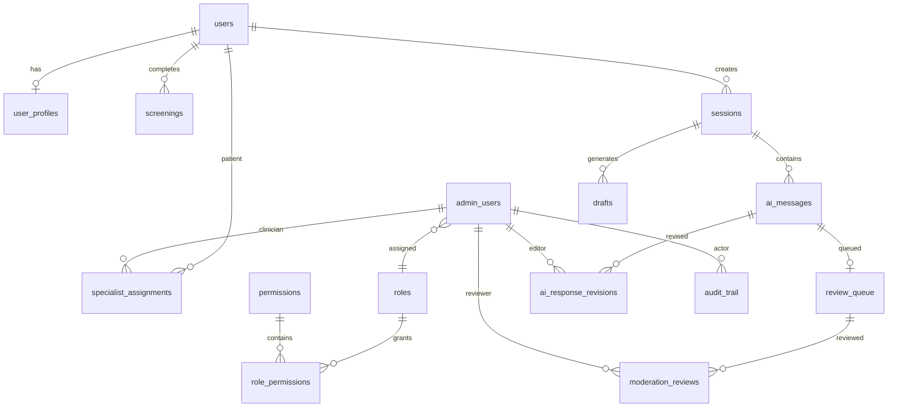

# Thiết kế cơ sở dữ liệu: User Management và AI Moderation

> Bản này đã được **reconcile với hệ thống Agent CBT v4 đang chạy** (safety gate L0–L3,
> ReAct 6 tool, 4-field drafts, HITL review). Các điểm khác biệt so với bản nháp ban
> đầu được đánh dấu **[RECONCILE]**.

## 1. Mục tiêu và phạm vi

Tài liệu này cụ thể hóa thiết kế cho hai module:

- **User Management**: quản lý tài khoản, hồ sơ, trạng thái, mức rủi ro, lịch sử sàng lọc và chuyên viên phụ trách.
- **AI Moderation**: hàng đợi kiểm duyệt, checklist an toàn, quyết định của chuyên viên, phiên bản câu trả lời và lịch sử thao tác.

Thiết kế dùng PostgreSQL, UUID, thời gian có múi giờ (`timestamptz`). Schema đích kế thừa dữ liệu hiện có nhưng tách tài khoản ứng dụng (`users`) khỏi tài khoản quản trị (`admin_users`) và bổ sung `ai_messages` để hỗ trợ hội thoại nhiều lượt.

## 2. Nguyên tắc thiết kế

1. Dữ liệu sức khỏe và nội dung hội thoại là PHI/PII, mã hóa ở tầng ứng dụng bằng AES-256-GCM.
2. API danh sách không giải mã nội dung hội thoại; chỉ API chi tiết có quyền phù hợp mới được giải mã.
3. Mọi hành động quản trị phải ghi `audit_trail`; bảng audit chỉ được thêm mới (append-only).
4. Trạng thái thường xuyên lọc/thống kê phải là cột chuẩn hóa, không chỉ nằm trong JSONB.
5. Bản ghi nghiệp vụ y tế không xóa cứng. Tài khoản dùng `deleted_at` hoặc trạng thái vô hiệu hóa.
6. Tài khoản ứng dụng và tài khoản quản trị thuộc hai miền bảo mật khác nhau, không dùng chung bảng.
7. Một người dùng chỉ có tối đa một phân công chuyên viên đang hoạt động.
8. Một phiên AI có nhiều tin nhắn; đơn vị kiểm duyệt là một phản hồi AI cụ thể, không phải toàn bộ session.

### 2.1. Chuẩn Risk Level duy nhất

Toàn hệ thống chỉ lưu một mã `risk_level`:

| Mã | Nhãn hiển thị | Ý nghĩa |
|---|---|---|
| `L0` | Crisis | Rủi ro rất cao / khủng hoảng |
| `L1` | High Risk | Rủi ro cao |
| `L2` | Medium Risk | Rủi ro trung bình |
| `L3` | Low Risk / Safe | Rủi ro thấp hoặc an toàn |

Số càng nhỏ thì rủi ro càng cao. Database và API chỉ trao đổi `L0`–`L3`; frontend chịu trách nhiệm mapping mã sang nhãn, màu sắc và nội dung tiếng Việt. **Không** lưu đồng thời các giá trị `low`, `moderate`, `elevated`, `high`, `crisis`.

> **[RECONCILE #2 — tránh trùng tên `risk_level`]** Trong code Agent, biến `risk_level` mang nghĩa *tầng định tuyến RAG* (`"normal"` / `"elevated"`) — KHÁC hoàn toàn với `risk_level` L0–L3 của database. Để tránh nhầm lẫn/bug:
> - **Database**: cột `risk_level` chỉ chứa `L0`–`L3`.
> - **Agent (in-memory)**: đổi tên biến định tuyến thành `retrieval_tier`, KHÔNG lưu xuống DB. `retrieval_tier` được derive từ `risk_level` (L0/L1 → `elevated`, L2/L3 → `normal`).

> **[RECONCILE #3 — không lưu `severity`]** Agent sinh `severity` (critical/high/moderate/low) chỉ để phục vụ logic runtime. **Không** thêm cột `severity` vào DB; derive từ `risk_level` khi cần: `L0→critical, L1→high, L2→moderate, L3→low`. (Cột `sessions.severity` legacy sẽ bị bỏ trong giai đoạn cutover.)

## 3. Mô hình quan hệ tổng thể



> **[RECONCILE #4 — hệ thống đã có bảng `conversations`]** Hệ thống hiện tại dùng `conversations` (thread) + `sessions` (mỗi lượt chat lưu `user_input_enc` + `final_reply_enc`). Bản thiết kế này hợp nhất như sau:
> - `conversations` (hiện có) → trở thành **header phiên** (vai trò `sessions` trong sơ đồ).
> - `sessions` (mỗi lượt, hiện có) → tách thành các dòng **`ai_messages`** (mỗi lượt user/AI là một dòng).
>
> Để tránh đập vỡ tên bảng đang chạy, migration giữ `conversations` làm header và tạo `ai_messages` trỏ về `conversation_id`. Tên "sessions" trong tài liệu = bảng header (`conversations`).

## 4. Module User Management

### 4.1. Bảng `users` — tài khoản và trạng thái truy cập

`users` chỉ quản lý người dùng ứng dụng. Admin, Manager, Clinician chuyển sang `admin_users`.

| Cột | Kiểu | Ràng buộc | Ý nghĩa |
|---|---|---|---|
| `id` | UUID | PK | Định danh tài khoản |
| `username` | varchar(80) | NOT NULL, UNIQUE | Tên đăng nhập |
| `email_enc` | bytea | NULL | Email mã hóa |
| `email_hash` | char(64) | UNIQUE, NULL | Blind index để tìm/tránh trùng email |
| `password_hash` | text | NOT NULL | Argon2id/bcrypt hash |
| `status` | varchar(20) | CHECK | `pending`, `active`, `suspended`, `deactivated` |
| `email_verified` | boolean | NOT NULL DEFAULT false | Trạng thái xác minh email |
| `consent_at` | timestamptz | NULL | Thời điểm chấp thuận điều khoản |
| `current_risk_level` | char(2) | CHECK, NULL | `L0`–`L3` (denormalized) |
| `latest_screening_id` | UUID | FK → `screenings.id`, NULL | Kết quả sàng lọc mới nhất |
| `created_at` | timestamptz | NOT NULL | Thời điểm tạo |
| `updated_at` | timestamptz | NOT NULL | Thời điểm cập nhật |
| `last_login_at` | timestamptz | NULL | Đăng nhập gần nhất |
| `deleted_at` | timestamptz | NULL | Soft delete |

Ghi chú triển khai:

- Hệ thống hiện lưu `email` dạng chuỗi. Khi migration: thêm `email_enc` + `email_hash`, backfill, rồi mới ẩn/bỏ cột cũ.
- `current_risk_level` là dữ liệu denormalized để tải danh sách nhanh. Nguồn sự thật vẫn là `screenings` và `ai_messages`.

### 4.2. Bảng `admin_users` và RBAC

| Cột | Kiểu | Ràng buộc | Ý nghĩa |
|---|---|---|---|
| `id` | UUID | PK | Định danh nhân sự quản trị |
| `username` | varchar(80) | NOT NULL, UNIQUE | Tên đăng nhập nội bộ |
| `full_name` | varchar(150) | NOT NULL | Tên hiển thị |
| `email_enc` | bytea | NOT NULL | Email công việc mã hóa |
| `email_hash` | char(64) | NOT NULL, UNIQUE | Blind index email |
| `password_hash` | text | NOT NULL | Argon2id/bcrypt hash |
| `role_id` | UUID | FK → `roles.id` | Vai trò hiện tại |
| `status` | varchar(20) | CHECK | `pending`, `active`, `suspended`, `deactivated` |
| `two_factor_enabled` | boolean | NOT NULL DEFAULT false | Trạng thái 2FA |
| `last_login_at` | timestamptz | NULL | Đăng nhập gần nhất |
| `created_at` | timestamptz | NOT NULL | Thời điểm tạo |
| `updated_at` | timestamptz | NOT NULL | Thời điểm cập nhật |
| `deleted_at` | timestamptz | NULL | Soft delete |

RBAC dùng ba bảng:

- `roles(id, code, name, description)`: `admin`, `manager`, `clinician`.
- `permissions(id, key, description)`: quyền nguyên tử như `users.pii.read`, `users.assign`, `moderation.decide`.
- `role_permissions(role_id, permission_id)`: bảng nối, khóa chính kép.

Không cho khóa/xóa admin cuối cùng có quyền quản trị role. Backend quản trị xác thực từ `admin_users`, không còn dựa vào `users.role`.

### 4.3. Bảng `user_profiles` — hồ sơ PII

| Cột | Kiểu | Ràng buộc | Ý nghĩa |
|---|---|---|---|
| `user_id` | UUID | PK, FK → `users.id` ON DELETE CASCADE | Chủ hồ sơ |
| `full_name_enc` | bytea | NULL | Họ tên mã hóa |
| `phone_enc` | bytea | NULL | SĐT mã hóa |
| `date_of_birth_enc` | bytea | NULL | Ngày sinh mã hóa |
| `gender` | varchar(30) | NULL | Giới tính tự khai báo |
| `address_enc` | bytea | NULL | Địa chỉ mã hóa |
| `emergency_contact_enc` | bytea | NULL | JSON liên hệ khẩn cấp mã hóa |
| `user_group` | varchar(50) | NULL | Nhóm phục vụ lọc/báo cáo |
| `created_at` | timestamptz | NOT NULL | Thời điểm tạo |
| `updated_at` | timestamptz | NOT NULL | Thời điểm cập nhật |

API danh sách chỉ trả dữ liệu masking (`ng***@mail.com`). Dữ liệu đầy đủ chỉ trả khi actor có quyền `users.pii.read` và hành động đọc được audit.

### 4.4. Bảng `specialist_assignments` — phân công chuyên viên

| Cột | Kiểu | Ràng buộc |
|---|---|---|
| `id` | UUID | PK |
| `user_id` | UUID | FK → `users.id`, NOT NULL |
| `clinician_id` | UUID | FK → `admin_users.id`, NOT NULL |
| `assigned_by` | UUID | FK → `admin_users.id`, NOT NULL |
| `status` | varchar(20) | `active` hoặc `ended` |
| `note` | text | NULL |
| `assigned_at` | timestamptz | NOT NULL |
| `ended_at` | timestamptz | NULL |

```sql
CREATE UNIQUE INDEX uq_specialist_assignment_active_user
ON specialist_assignments (user_id)
WHERE status = 'active';
```

Khi gán chuyên viên mới, transaction phải kết thúc phân công cũ rồi tạo phân công mới.

### 4.5. Bảng liên quan được tái sử dụng

- `screenings`: lịch sử PHQ-9, GAD-7, mood và mức độ.
- `conversations` / `ai_messages`: header + lượt hội thoại; `ai_messages` cung cấp mức L0–L3 và trạng thái kiểm duyệt.
- `user_memory`: bản tóm tắt hỗ trợ liên tục giữa các phiên; trường ngữ cảnh cá nhân phải mã hóa.
- `audit_trail`: lịch sử tạo tài khoản, đổi trạng thái, xem PII, export và phân công; `actor_id` tham chiếu `admin_users.id`.

### 4.6. Index cho User Management

```sql
CREATE UNIQUE INDEX uq_users_username_ci
ON users (lower(username)) WHERE deleted_at IS NULL;

CREATE INDEX idx_users_admin_list
ON users (status, created_at DESC) WHERE deleted_at IS NULL;

CREATE INDEX idx_users_current_risk
ON users (current_risk_level, status) WHERE deleted_at IS NULL;

CREATE INDEX idx_admin_users_role_status
ON admin_users (role_id, status) WHERE deleted_at IS NULL;
```

Không tạo B-tree index trực tiếp trên dữ liệu PII mã hóa. Tìm chính xác email dùng `email_hash`.

## 5. Module AI Moderation

### 5.1. Bảng header phiên (`conversations`)

Header một phiên hội thoại — không lưu trực tiếp nội dung trao đổi.

| Cột | Kiểu | Ràng buộc | Ý nghĩa |
|---|---|---|---|
| `id` | UUID | PK | Định danh phiên |
| `user_id` | UUID | FK → `users.id` | Chủ phiên |
| `title` | varchar(200) | NULL | Tiêu đề hiển thị |
| `status` | varchar(20) | CHECK | `active`, `closed`, `archived` |
| `highest_risk_level` | char(2) | CHECK, NULL | Mức cao nhất `L0`–`L3` trong phiên |
| `message_count` | integer | NOT NULL DEFAULT 0 | Số tin nhắn denormalized |
| `started_at` | timestamptz | NOT NULL | Bắt đầu |
| `last_message_at` | timestamptz | NULL | Hoạt động gần nhất |
| `ended_at` | timestamptz | NULL | Kết thúc |
| `metadata` | jsonb | NULL | Trace/model metadata, KHÔNG chứa plaintext PHI |

### 5.2. Bảng `ai_messages` — toàn bộ lịch sử hội thoại

Mỗi lượt user/AI là một dòng. Đây là nguồn dữ liệu trực tiếp của AI Moderation.

| Cột | Kiểu | Ràng buộc | Ý nghĩa |
|---|---|---|---|
| `id` | UUID | PK | Định danh tin nhắn |
| `conversation_id` | UUID | FK → `conversations.id` ON DELETE CASCADE | Phiên chứa tin nhắn |
| `sender` | varchar(10) | CHECK | `user`, `ai`, `system` |
| `parent_message_id` | UUID | FK → `ai_messages.id`, NULL | Tin nhắn user mà AI đang trả lời |
| `content_enc` | bytea | NOT NULL | Nội dung mã hóa AES-256-GCM |
| `content_hash` | char(64) | NOT NULL | Toàn vẹn/chống trùng, không dùng hiển thị |
| `risk_level` | char(2) | CHECK, NULL | `L0`–`L3` |
| `ai_confidence` | numeric(5,4) | CHECK 0–1, NULL | Độ tin cậy nếu sender là AI |
| `model_name` | varchar(100) | NULL | Model sinh phản hồi |
| `moderation_status` | varchar(25) | CHECK | `not_required`, `pending`, `approved`, `edited`, `rejected`, `need_improvement` |
| `created_at` | timestamptz | NOT NULL | Thời điểm tạo |
| `deleted_at` | timestamptz | NULL | Soft delete |

Quy tắc dữ liệu:

- Tin nhắn AI phải có `parent_message_id` trỏ tới tin nhắn `sender='user'` cùng phiên.
- `ai_confidence`, `model_name` chỉ có nghĩa với tin nhắn AI.
- Không sửa đè `content_enc` sau khi vào moderation; bản chỉnh sửa lưu trong `ai_response_revisions`.
- Nội dung chỉ giải mã tại service sau khi kiểm tra quyền + ghi audit.

> **[RECONCILE #5 — map outcome Agent → `moderation_status`]**
> | Outcome của Agent (`chat.py`) | `ai_messages.moderation_status` |
> |---|---|
> | L3 auto_sent | `not_required` |
> | L2 pending_review | `pending` |
> | `escalate_to_clinician` (kể cả L3) | `pending` + tạo `review_queue` |
> | `needs_clarification` | `not_required` (là một lượt AI hỏi lại bình thường) |
> | L0 / L1 (không sinh AI reply) | KHÔNG tạo `ai_messages` sender='ai'; xem #5.3 |

### 5.3. Bảng `review_queue` — trạng thái hiện tại của hàng đợi

> **[RECONCILE #6 — tên bảng triển khai]** `review_queue` legacy hiện dùng `session_id` làm PK (không có cột `id` surrogate) nên không thể mở rộng sạch sang per-message, và đổi tên sẽ phá backend đang chạy. Vì vậy hàng đợi per-message được triển khai là **bảng MỚI `moderation_queue`** (cùng cấu trúc mô tả dưới đây); `review_queue` cũ deprecated và bị bỏ ở giai đoạn cutover. Trong tài liệu, "review_queue" = bảng `moderation_queue` mới.

Mỗi phản hồi AI có tối đa một bản ghi hàng đợi. Một phiên nhiều lượt có thể có nhiều queue item.

| Cột | Kiểu | Ràng buộc | Ý nghĩa |
|---|---|---|---|
| `id` | UUID | PK | Định danh queue item |
| `conversation_id` | UUID | FK → `conversations.id` ON DELETE CASCADE | Phiên |
| `user_message_id` | UUID | FK → `ai_messages.id`, NOT NULL | Tin nhắn người dùng nguồn |
| `ai_message_id` | UUID | FK → `ai_messages.id`, **NULL**, UNIQUE | Phản hồi AI cần duyệt (NULL với L0/L1) |
| `kind` | varchar(20) | CHECK | `ai_review` hoặc `user_escalation` |
| `status` | varchar(25) | CHECK | `pending`, `claimed`, `need_improvement`, `resolved`, `cancelled` |
| `risk_level` | char(2) | CHECK | Snapshot `L0`–`L3` khi vào hàng đợi |
| `priority` | smallint | CHECK 0–100 | Số càng lớn càng ưu tiên |
| `sla_due_at` | timestamptz | NULL | Hạn xử lý |
| `claimed_by` | UUID | FK → `admin_users.id`, NULL | Chuyên viên giữ |
| `claimed_at` | timestamptz | NULL | Thời điểm claim |
| `claim_expires_at` | timestamptz | NULL | Tránh khóa vĩnh viễn |
| `resolution` | varchar(25) | CHECK, NULL | `approve`, `edit`, `reject` |
| `created_at` | timestamptz | NOT NULL | Vào hàng đợi |
| `resolved_at` | timestamptz | NULL | Hoàn tất |
| `version` | integer | NOT NULL DEFAULT 1 | Optimistic locking |

> **[RECONCILE #1 — QUAN TRỌNG NHẤT — L0/L1 không có AI reply]**
> Agent xử lý L0 (crisis screen) và L1 (đẩy chuyên gia) **tất định, KHÔNG sinh phản hồi AI**. Vì vậy:
> - `ai_message_id` phải **nullable**.
> - Cột `kind` phân biệt: `ai_review` (có phản hồi AI cần duyệt — L2/escalate) vs `user_escalation` (L0/L1 — chỉ có tin nhắn người dùng cần chuyên gia tiếp cận, `ai_message_id` = NULL).
> - Ràng buộc: `CHECK (kind = 'user_escalation' OR ai_message_id IS NOT NULL)`.

Quy tắc (SLA cấu hình được, KHÔNG hard-code):

- `L0`: luôn vào queue, `kind='user_escalation'`, ưu tiên khẩn cấp, SLA ngắn nhất (vd 5 phút).
- `L1`: luôn vào queue, `kind='user_escalation'`, ưu tiên cao, SLA ngắn (vd 30 phút).
- `L2`: vào queue, `kind='ai_review'`, ưu tiên trung bình (vd SLA 4 giờ).
- `L3`: tự động phản hồi hoặc kiểm duyệt ngẫu nhiên theo cấu hình; nếu `escalate_to_clinician` thì vào queue `kind='ai_review'`.
- Chỉ người đang claim hoặc admin mới được thao tác. Claim dùng `SELECT ... FOR UPDATE` hoặc cập nhật có điều kiện theo `version`.
- `need_improvement` không đóng queue; `approve`/`edit`/`reject` mới đặt `resolved_at`.

### 5.4. Bảng `moderation_reviews` — lịch sử quyết định bất biến

Mỗi lần lưu checklist/ra quyết định tạo một bản ghi mới. Không cập nhật đè.

| Cột | Kiểu | Ràng buộc |
|---|---|---|
| `id` | UUID | PK |
| `queue_item_id` | UUID | FK → `review_queue.id` ON DELETE CASCADE |
| `conversation_id` | UUID | FK → `conversations.id` ON DELETE CASCADE |
| `ai_message_id` | UUID | FK → `ai_messages.id`, NULL |
| `reviewer_id` | UUID | FK → `admin_users.id` |
| `decision` | varchar(25) | `approve`, `edit`, `reject`, `need_improvement` |
| `empathy` | boolean | NOT NULL |
| `no_diagnosis` | boolean | NOT NULL |
| `cbt_based` | boolean | NOT NULL |
| `safe_response` | boolean | NOT NULL |
| `referral_when_needed` | boolean | NOT NULL |
| `no_medication_advice` | boolean | NOT NULL DEFAULT true |
| `no_overclaiming` | boolean | NOT NULL DEFAULT true |
| `note_enc` | bytea | NULL |
| `response_revision_id` | UUID | FK → `ai_response_revisions.id`, NULL |
| `created_at` | timestamptz | NOT NULL |

Điều kiện approve/edit:

```sql
CHECK (
    decision NOT IN ('approve', 'edit') OR
    (empathy AND no_diagnosis AND cbt_based AND safe_response
     AND referral_when_needed AND no_medication_advice AND no_overclaiming)
)
```

`referral_when_needed` chỉ bắt buộc với L0/L1 — kiểm tra trong service transaction vì CHECK của một bảng không đọc được `ai_messages.risk_level` an toàn.

### 5.5. Bảng `ai_response_revisions` — phiên bản phản hồi đã chỉnh sửa

| Cột | Kiểu | Ràng buộc |
|---|---|---|
| `id` | UUID | PK |
| `conversation_id` | UUID | FK → `conversations.id` ON DELETE CASCADE |
| `ai_message_id` | UUID | FK → `ai_messages.id` ON DELETE CASCADE |
| `source_draft_id` | UUID | FK → `drafts.id`, NULL |
| `revision_no` | integer | NOT NULL |
| `response_enc` | bytea | NOT NULL |
| `response_hash` | char(64) | NOT NULL |
| `edited_by` | UUID | FK → `admin_users.id` |
| `edit_reason_enc` | bytea | NULL |
| `created_at` | timestamptz | NOT NULL |

`UNIQUE(ai_message_id, revision_no)` bảo đảm thứ tự phiên bản. Khi duyệt bản chỉnh sửa: `ai_messages.moderation_status='edited'` + review lưu `response_revision_id`; nội dung gốc được bảo toàn.

> **[RECONCILE — `drafts.source_user_message_id`]** Bảng `drafts` (hiện có, N phương án LLM sinh) cần thêm `source_user_message_id` (FK → `ai_messages.id`, NULL) để gắn đúng lượt hỏi trong phiên nhiều lượt. Phương án được chọn trở thành `content_enc` của `ai_messages` sender='ai'.

### 5.6. Index cho AI Moderation

```sql
CREATE INDEX idx_review_queue_open_priority
ON review_queue (priority DESC, sla_due_at ASC, created_at ASC)
WHERE resolved_at IS NULL;

CREATE INDEX idx_review_queue_claimant
ON review_queue (claimed_by, claim_expires_at) WHERE resolved_at IS NULL;

CREATE INDEX idx_ai_messages_conv_time
ON ai_messages (conversation_id, created_at ASC) WHERE deleted_at IS NULL;

CREATE INDEX idx_ai_messages_moderation_filter
ON ai_messages (moderation_status, risk_level, created_at DESC)
WHERE sender = 'ai' AND deleted_at IS NULL;

CREATE UNIQUE INDEX uq_ai_response_revision_no
ON ai_response_revisions (ai_message_id, revision_no);
```

## 6. Luồng transaction chính

### 6.1. Tạo người dùng
1. Chuẩn hóa username/email. 2. Tính blind index email, kiểm tra trùng.
3. Tạo `users` + `user_profiles` cùng transaction. 4. Ghi `audit_trail(action='user_create')`, không ghi PII rõ.

### 6.2. Gán chuyên viên
1. Khóa phân công active hiện tại. 2. Đặt phân công cũ `ended`. 3. Tạo `specialist_assignments` mới. 4. Ghi audit.

### 6.3. Đưa phiên vào kiểm duyệt
1. Tạo/cập nhật header `conversations`. 2. Ghi tin nhắn user + (nếu có) phản hồi AI vào `ai_messages`, liên kết `parent_message_id`.
3. Safety gate gán `risk_level` L0–L3 cho từng tin nhắn. 4. Map outcome → `moderation_status` (xem #5.2).
5. Tạo `review_queue` với `kind`/priority/SLA phù hợp (L0/L1 → `user_escalation`, ai_message_id NULL).

### 6.4. Duyệt / chỉnh sửa / yêu cầu cải thiện
Trong một transaction: 1. Khóa `review_queue`, xác thực claimant/version. 2. Kiểm tra checklist + quyền.
3. Nếu chỉnh sửa, tạo `ai_response_revisions`. 4. Tạo `moderation_reviews` append-only.
5. Cập nhật `ai_messages.moderation_status`. 6. Đóng `review_queue` + ghi `audit_trail`.
`need_improvement`: tạo review, đặt message/queue về `need_improvement`, **không** đặt `resolved_at`. Lỗi bất kỳ bước nào → rollback toàn bộ.

## 7. Mapping API với bảng dữ liệu

| API | Bảng chính |
|---|---|
| `GET /api/admin/users` | `users`, aggregate `conversations`/`ai_messages`, latest `screenings`, active `specialist_assignments` |
| `GET /api/admin/users/{id}` | `users`, `user_profiles`, `screenings`, `conversations`, `user_memory` |
| `POST /api/admin/users` | `users`, `user_profiles`, `audit_trail` |
| `POST /api/admin/users/{id}/status` | `users`, `audit_trail` |
| `POST /api/admin/users/{id}/assign-clinician` | `specialist_assignments`, `audit_trail` |
| `GET /api/admin/ai-moderation/stats` | `review_queue`, `moderation_reviews` |
| `GET /api/admin/ai-moderation/items` | `review_queue`, `ai_messages`, `conversations`, masked `users` |
| `GET /api/admin/ai-moderation/items/{queue_item_id}` | `conversations`, `ai_messages`, `drafts`, queue, reviews, revisions |
| `PATCH .../items/{queue_item_id}/claim` | `review_queue`, `audit_trail` |
| `PATCH .../items/{queue_item_id}/approve` | reviews, `ai_messages`, queue, `audit_trail` |
| `PATCH .../items/{queue_item_id}/edit-response` | revisions, reviews, `ai_messages`, queue, audit |
| `PATCH .../items/{queue_item_id}/reject` | reviews, `ai_messages`, queue, audit |
| `PATCH .../items/{queue_item_id}/need-improvement` | reviews, `ai_messages`, queue, audit |

`queue_item_id` là `review_queue.id`, không phải `conversation_id`. Route cũ `/sessions/{id}` chỉ giữ tạm qua compatibility adapter (đánh dấu deprecated). Code mới dùng `/items/{queue_item_id}`.

## 8. Phân quyền tối thiểu

| Permission | Admin | Clinician | Manager/Viewer |
|---|:---:|:---:|:---:|
| `users.list` | ✓ | Chỉ user được gán | ✓ (masked) |
| `users.pii.read` | ✓ | Chỉ user được gán | ✗ |
| `users.create/status` | ✓ | ✗ | ✗ |
| `admin_users.manage_roles` | ✓ | ✗ | ✗ |
| `users.assign` | ✓ | ✗ | ✓ |
| `moderation.list/detail` | ✓ | ✓ | Chỉ đọc masked |
| `moderation.claim/release` | ✓ | ✓ | ✗ |
| `moderation.decide/edit` | ✓ | ✓ | ✗ |
| `audit.read` | ✓ | Hạn chế | Hạn chế |

## 9. Kế hoạch migration từ schema hiện tại

1. Tạo `roles`, `permissions`, `role_permissions`, `admin_users`.
2. Chuyển `users.role IN ('admin','clinician')` sang `admin_users`; lập bảng ánh xạ ID tạm để cập nhật khóa ngoại.
3. Cập nhật khóa ngoại reviewer/editor/actor sang `admin_users.id`.
4. Bỏ `role` khỏi `users` (giai đoạn cutover); thêm `user_profiles`, risk/soft-delete, blind index email.
5. Tạo `ai_messages`; chuyển `sessions.user_input_enc` → message `user`, `final_reply_enc`/draft được chọn → message `ai`; thêm `drafts.source_user_message_id`; map `triage_level` cũ → `risk_level`.
6. Mở rộng `review_queue` sang per-`ai_message_id` (thêm `ai_message_id` nullable, `user_message_id`, `kind`, `status`, `claim_expires_at`, `version`).
7. Tạo `ai_response_revisions`; chuyển `edited_response` JSONB → revision mã hóa.
8. Tạo `moderation_reviews` checklist boolean, backfill từ JSONB.
9. Chuyển `moderation_status` khỏi `sessions.analysis` sang `ai_messages.moderation_status`.
10. Cập nhật API/auth dùng hai principal; sau một chu kỳ ổn định mới xóa cột legacy.

Mọi migration cần `downgrade`, chạy thử trên bản sao dữ liệu, không log plaintext PII/PHI khi backfill.

## 10. Tiêu chí nghiệm thu

- Không thể tạo hai phân công active cho cùng một user.
- Người dùng ứng dụng không đăng nhập được API quản trị và ngược lại.
- Một phiên lưu nhiều lượt user/AI đúng thứ tự và quan hệ phản hồi.
- Một phản hồi AI chỉ có tối đa một queue item; **L0/L1 vẫn vào queue qua `user_escalation` dù không có AI reply**.
- Không thể approve phản hồi khi thiếu tiêu chí an toàn bắt buộc.
- Hai chuyên viên không thể đồng thời quyết định cùng một queue item.
- Mọi thay đổi trạng thái user và quyết định moderation đều có audit.
- Danh sách user/moderation không giải mã nội dung chat hoặc PII đầy đủ.
- Nội dung user/AI, ghi chú nhạy cảm, phiên bản chỉnh sửa mã hóa at-rest.
- Database/API chỉ dùng L0–L3, không trả song song tên mức rủi ro và mã triage.
