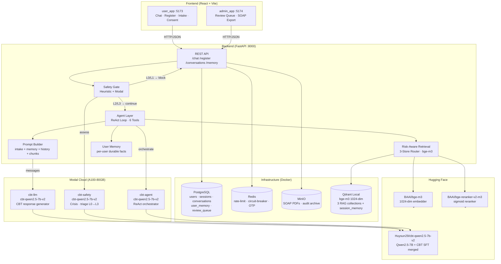
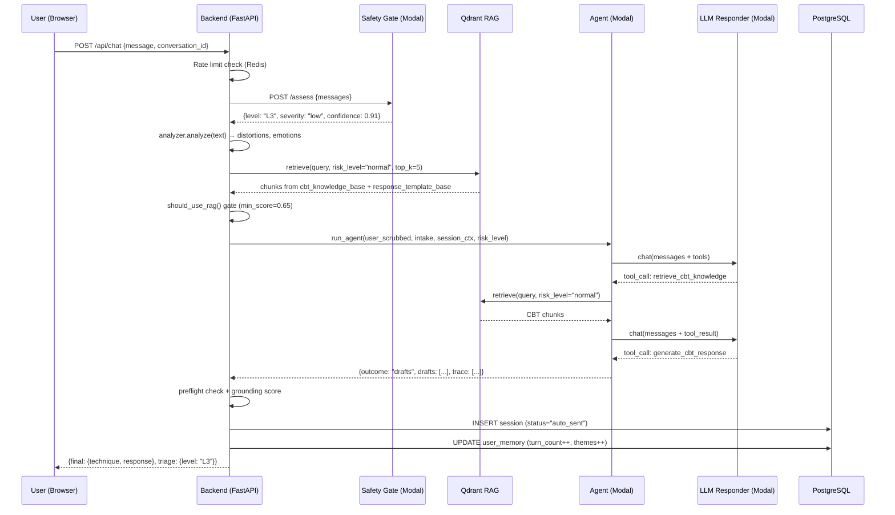
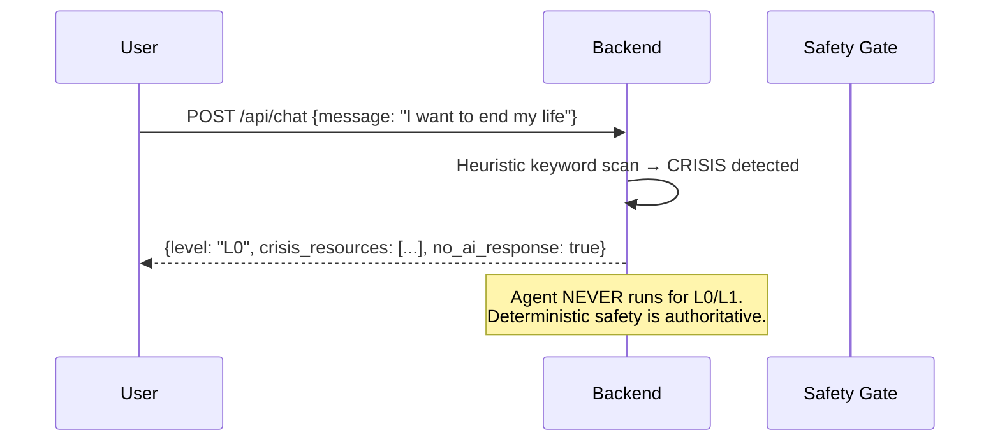
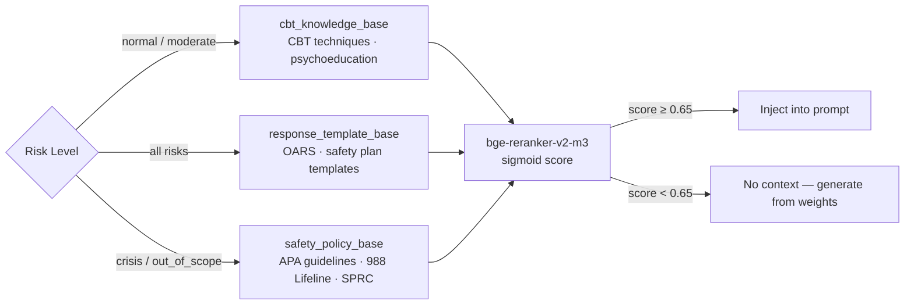
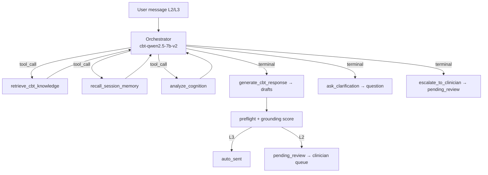

# System Architecture — CBT AI Mental Health Screening & Triage

## Overview

AI-Assisted Mental Health Screening & Triage System with CBT-Informed Response Generation.
A student wellbeing platform that combines safety-first clinical triage, risk-aware RAG retrieval,
and an agentic ReAct loop — all grounded in a fine-tuned CBT model.

---

## Component Diagram

---

## Data Flow — Chat Request (L3 Routine)

---

## Data Flow — Crisis Screening (L0)

---

## Risk-Aware RAG — 3-Store Router

---

## Agent ReAct Loop

---

## Model — Evaluation Summary (M4)

| Metric | Score |
|---|---|
| Risk classification accuracy | **97.09%** |
| Crisis recall | **96.60%** |
| Response quality (C_quality) | **3.547 / 5** |
| RAG gate use_rag rate | 19.4% |
| Agent mean hops | 1.52 |
| Medication violation rate | **0%** |

Model: `Huysun29/cbt-qwen2.5-7b-v2` (Qwen2.5-7B-Instruct + CBT SFT, full merged)
